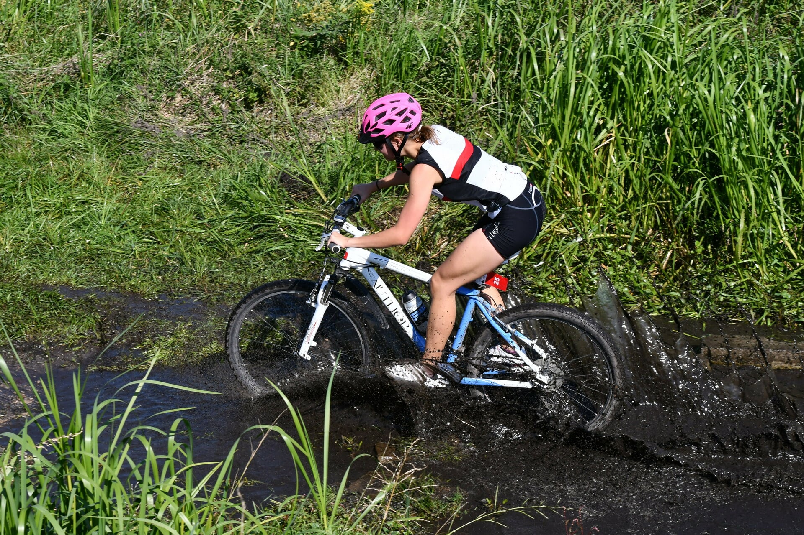

# Hanna Jarlaczynska

##  About me
I am studying **Computer Science** at [AGH University of Science and Technology](https://www.agh.edu.pl/en/ "https://www.agh.edu.pl/en/").
I am interested in **Artificial Intelligence** and **Data Science**. Currently I am doing many projects with my classmates, learning some useful IT  skills and having fun.

In my free time, I love doing sports - especially *triathlon* and *sport shooting*.

*That's me on triathlon competition!*

## My latest project
Recently I finished a project for Tools in Computer Science classes. Together with my  with my colleagues we created **Project Labyrinth**.
Our programme **generates mazes** using many different algorithms. We used Python to code it and libaries such as tkinter and pygame. We have learned how to use many IT tools and improved our teamwork skills.

*An example of maze that our algorithm generates.*

For more details check out [documentation](https://github.com/AGH-Narzedzia-Informatyczne/Project_Labyrinth/wiki/1.-LABIRYNTY) of our project.
